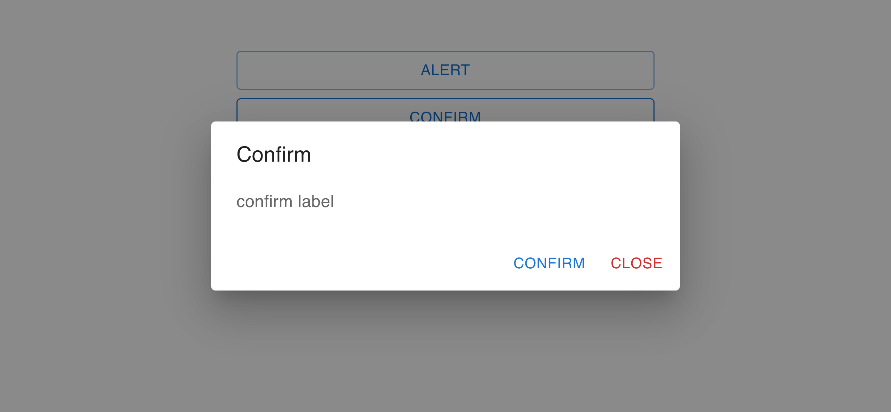

# @caminkunick/react-popup-box

> Made with create-react-library

[](https://www.npmjs.com/package/@caminkunick/react-popup-box) [](https://standardjs.com)

## Install

```bash
npm install --save @caminkunick/react-popup-box
```

## Screenshot

> Alert


> Confirm



> Remove


> Prompt


## Usage

```tsx
// index.tsx

...

import { PopupProvider } from '@caminkunick/react-popup-box'

ReactDOM.render(
  <PopupProvider>
    <App />
  </PopupProvider>,
  document.getElementById('root')
)

...

```


```tsx
// App.tsx

import React from 'react'

import { usePopup } from '@caminkunick/react-popup-box'
import '@caminkunick/react-popup-box/dist/index.css'
import { Button, Container, Stack } from '@mui/material'

const App = () => {
  const { Alerts } = usePopup()

  const handleAlert = () => {
    Alerts.alert(
      'Alert',
      'alert label'
    );
  }
  const handleConfirm = () => {
    Alerts.confirm(
      'Confirm',
      'confirm label',
      () => console.log('confirm!')
    );
  }
  const handleRemove = () => {
    Alerts.remove(
      'Remove',
      'remove label',
      () => console.log('remove!')
    );
  }
  const handlePrompt = () => {
    Alerts.prompt(
      'Prompt',
      'prompt label',
      (value) => console.log(value),
      'default prompt'
    )
  }

  return (
    <Container maxWidth='xs' sx={{ py: 6 }}>
      <Stack spacing={1}>
        <Button variant='outlined' onClick={handleAlert}>
          Alert
        </Button>
        <Button variant='outlined' onClick={handleConfirm}>
          Confirm
        </Button>
        <Button variant='outlined' onClick={handleRemove}>
          Remove
        </Button>
        <Button variant='outlined' onClick={handlePrompt}>
          Prompt
        </Button>
      </Stack>
    </Container>
  )
}

export default App

```

## Propties

> Alert

| Prop | Type | Description |
| -- | -- | -- |
| title | ReactNode | Title of Dialog |
| label | ReactNode | Label of Dialog |

> Confirm

| Prop | Type | Description |
| -- | -- | -- |
| title | ReactNode | Title of Dialog |
| label | ReactNode | Label of Dialog |
| onConfirm | func | callback function after confirm<br><br>Signature:<br><mark>function() => void</mark> |

> Remove

| Prop | Type | Description |
| -- | -- | -- |
| title | ReactNode | Title of Dialog |
| label | ReactNode | Label of Dialog |
| onConfirm | func | callback function after confirm<br><br>Signature:<br><mark>function() => void</mark> |

> Prompt

| Prop | Type | Description |
| -- | -- | -- |
| title | ReactNode | Title of Dialog |
| label | ReactNode | Label of Dialog |
| onChange | func | callback function after confirm<br><br>Signature:<br><mark>function(value:string) => void</mark>
 |

## License

MIT © [caminkunick](https://github.com/caminkunick)
